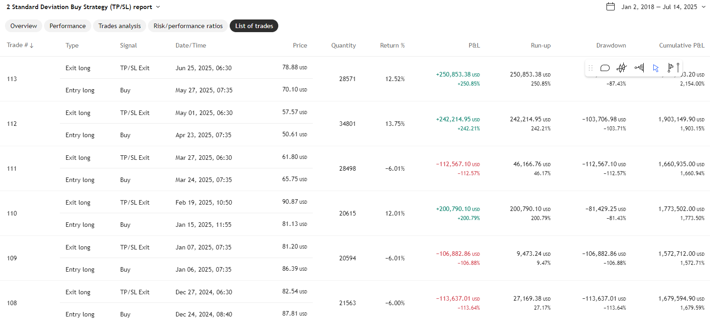

# Mike's Articles: Project Architecture

This document outlines the architecture of the MikesArticles project, instructions for running it locally, and ideas for future development.

## 1. Architectural Overview

This project is a simple, lightweight, file-based PHP website. Its primary purpose is to serve articles written in Markdown format to a private audience of friends and family. The architecture is intentionally minimalistic, avoiding the need for a database, which makes it easy to manage and deploy.

### Core Components:

*   **`index.php`**: The main entry point of the website. It is responsible for displaying a list of all available articles. It likely works by scanning the `articles/` directory and generating a link for each Markdown file it finds.
*   **`article.php`**: This script is responsible for displaying a single article. It expects a parameter in the URL (e.g., `?file=...`) that points to the specific Markdown file to be displayed. The script reads the content of the `.md` file, converts it from Markdown to HTML, and renders it within the site's template.
*   **`style.css`**: This file contains all the CSS rules to style the website, ensuring a consistent look and feel across the homepage and individual articles.
*   **`articles/` (Directory)**: This directory acts as the "database" for the website. It contains the raw content for all articles, stored as individual Markdown (`.md`) files. The sub-directory structure (e.g., `/epstein/`, `/trading models/`) serves as a way to categorize articles.
*   **`images/` (Directory)**: This directory stores all static image assets that are embedded within the articles.

### Request Flow:

1.  A user navigates to `http://localhost/MikesArticles/`.
2.  `index.php` is executed. It scans the `articles/` directory for content.
3.  `index.php` generates an HTML page with a list of links to each article.
4.  The user clicks on an article link, which directs them to a URL like `article.php?file=trading%20models/2025-07-22-first-article.md`.
5.  `article.php` reads the `file` parameter, locates the corresponding `.md` file, parses its content into HTML, and serves the final page to the user.

## 2. How to Run the Project

To view the website locally, you need to run the Apache web server using the XAMPP Control Panel.

1.  **Open the XAMPP Control Panel**: Navigate to `C:\xampp\` and run `xampp-control.exe`. Or run the following in a shell `c:\xampp\xampp-control.exe`
2.  **Start Apache**: In the control panel, find the **Apache** module and click the **Start** button. The module name will turn green, indicating it is running.
3.  **Access the Website**: Open your web browser and navigate to **`http://localhost/MikesArticles/`**.

## 3. Future Development Ideas

Here is a list of potential features to enhance the website:

*   **Dynamic Article Listing**: Implement PHP code in `index.php` to automatically scan the `articles/` directory and its subdirectories to build the list of articles dynamically.
*   **Markdown-to-HTML Parser**: Integrate a PHP library (like Parsedown) into `article.php` to automatically convert the Markdown content to HTML for proper display.
*   **Re-implement Markdown Parsing**: Re-evaluate and replace the custom Markdown parsing solution with a well-supported, popular library like `Parsedown` or `thephpleague/commonmark`. This will improve compatibility with standard Markdown features like images and links, and address issues with the current custom parser, such as the premature termination of parsing due to blank lines. This will involve:
    *   Researching and selecting the most appropriate library.
    *   Removing the existing custom parsing logic from `article.php`.
    *   Integrating the chosen library to handle Markdown-to-HTML conversion.
    *   Ensuring that all existing and future Markdown features (including images, links, and other formatting) are correctly rendered.
*   **SEO-Friendly URLs (URL Rewriting)**: Use an `.htaccess` file with `mod_rewrite` to transform URLs from `article.php?file=...` to a cleaner format like `/articles/category/title`.
*   **Article Metadata**: Add metadata to the top of the Markdown files (e.g., Title, Author, Date) in a YAML "front-matter" block to be parsed and displayed on the article page.
*   **Simple Search Functionality**: Add a search bar that allows users to search the content of all `.md` files for keywords.
*   **Bug -  Fix index.php to ignore markdown directives **: markdown directives should not be displayed in summary.  It should ignore these.  For example  is not the first paragraph and should be ignored for the index.php
*   **Basic Admin Panel**: Create a password-protected area where you can create, edit, and delete article files directly from the browser, without needing to touch the file system manually.

## 4. Session Logging

At the end of each development session, a log of new features, bug fixes, and modified files will be recorded in `SESSION_LOG.md`. This helps in tracking progress and changes made to the project.
